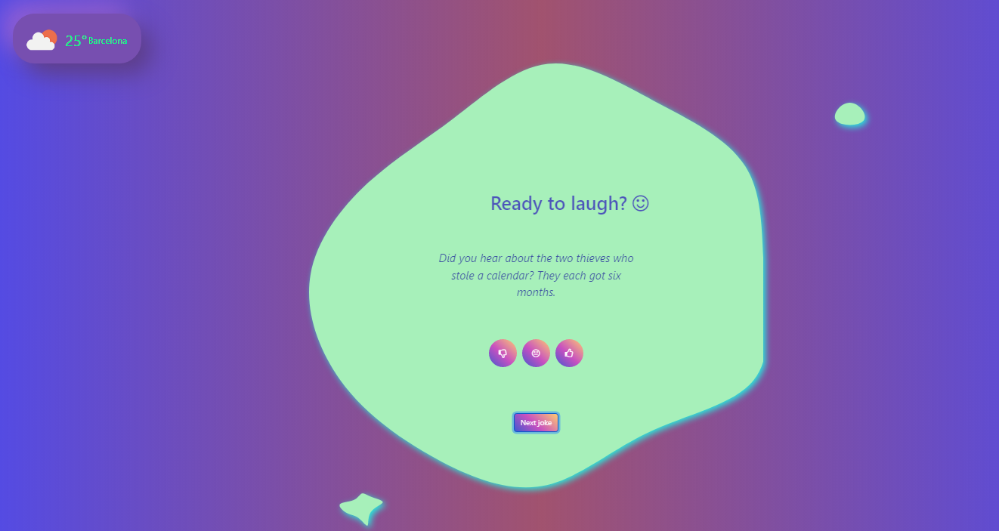

# 🤡 **JOKES-APP-REST/API-JS** 🤡

---

## **DESCRIPTION**

---

In the previous installments, the data we used on my websites was hardcoded it, but this is not the usual.
Like most real websites, we will consume data from an API in this exercise. Luckily, we don't have to implement an API to store data in a database, and be able to consume it with a series of calls. Instead, we will use a pre-made API that will allow me to get the data easily.
The most important theme that we will implement in this project is **retrieving data using so-called Rest APIs on a server**.

---

### **ASSIGMENT**

---

A coaching company is conducting an experiment on companies in Barcelona, ​​in which it is measuring the impact of humor and fun on productivity.

**We have been asked to create a web application that displays jokes to employees before the start of the workday.**

We will be in charge of carrying out the basis of the project to make a demo in two weeks with the client and start the tests with real users.

We will create a website of jokes, consuming data from a free API that does not require a key. You will also be able to instantly check the weather in your city.

1. The API documentation to consume for a dad joke is as follows:

[Dad´s jokes API doc](https://icanhazdadjoke.com/api)

- Call for a joke:

[Dad´s jokes](https://icanhazdadjoke.com/)

- Header to obtain the data in the format that interests us:

'Accept': 'application / json'

2. The API documentation to consume for a Chuck Norris joke is as follows:

[Chuck Norris API doc](https://api.chucknorris.io/#!)

- Call for a Chuck joke:

[ChuckNorris jokes](https://api.chucknorris.io/jokes/random)

3. The API documentation to consume weather data is as follows:

[Openweathermap API doc](https://openweathermap.org/appid)

---

## Simply put, the API URL we enter in this project is where we will consume the data, and the header is how I want the data.

---

## LEVEL 1 :star:

### 1. First, we will create the main screen that will display the jokes to the user.

The operation must be as follows:

- When entering you will not show any jokes. The title and the next joke button will appear _(I made it run from the start since there is only one button that says "Next Joke")_.

- Pressing the "Next joke" button will fetch the jokes APIs and display the console when prompted throughout the project.

_Help_

Tip 1: Use promises or async / await to wait for the API response.

Tip 2: Before using an API in code, it is recommended that you use Postman or online tools to test the API, for example -> [Talend API Tester](https://chrome.google.com/webstore/detail/talend-api-tester-free-ed/aejoelaoggembcahagimdiliamlcdmfm?hl=es-419). In addition to ensuring that it works, you will see the object that returns, so that you can use it.

### 2. The website already gets the peeps from the server and we showed the jokes by console, we need to show them to the user.

Make a first approximation of the layout, placing each element in its place. Don't worry about the details, we'll modify the layout later.

The aim of this exercise is for the user to be able to view the jokes and ask for new ones.

An item placement reference is as follows:

### 3. The company commissioning the project needs to monitor the use of this website for study.

To do this, we need to know the level of acceptance of the jokes, tracking employees moods and how many jokes are consumed on average.

_How does this request translate to our code?_

**_We will need to generate an array called reportJokes, in which I will store all the information related to the joke requested by the client._**

The three fields that each object in the array must have are:

{

joke: "...",

score: 1

date: ...

}

**The date on which the assessment was made must be saved in ISO format.**

To learn more about it, visit [JavaScript Data toISOString()](https://www.w3schools.com/Jsref/jsref_toisostring.asp)

The score field has a **range of 1 to 3, with 1 being the worst score**. You will need to implement 3 buttons between the joke and the button to load the next joke, so that the user can score it.

With the score of the joke, along with the joke and generating a date, you will have to fill in the reportJokes array.

When you update this array, **displaying its contents on the console will suffice.**

## LEVEL 2 :star2::star:

### 4. We already have an operational joke website. Now that the web is ready to be use early in the morning to get your day off to a good start, we'll be adding weather information as it can be useful.

We will consume a weather information API and display it on the web. This API should be display as soon as the page loads, not by a button.

Note: It is not yet necessary to model the website, just showing a word that indicates the time is enough.

### 5. The client has gave us the first feedback: users are getting bored of the app because we only display one kind of joke.

We need to find another API (or APIs) for jokes and use it to toggle jokes from different sources (either by alternating one of each or randomly).

Help: Chuck Norris jokes never fail.

## LEVEL 3 :star2::star2::star2:

### 6. Layout the website of jokes and weather according to the following screen:

## 
